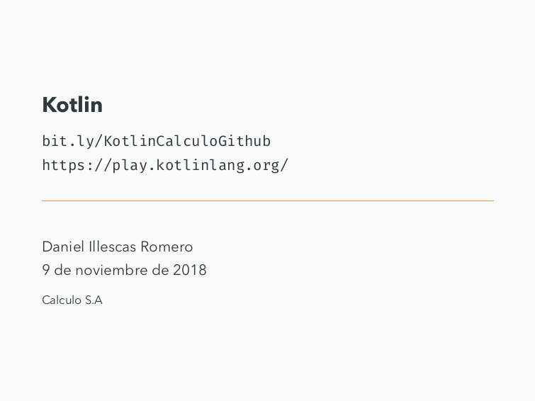
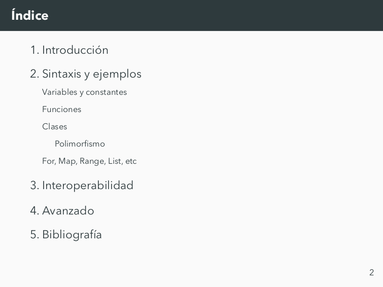
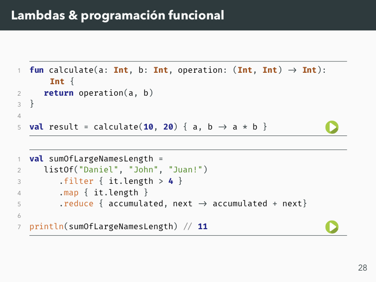

# Kotlin-Slides

Presentación para Calculo S.A sobre el lenguaje de programación Kotlin.

Tema usado para la presentación: [Metropolis](https://github.com/matze/mtheme)

# [Vista previa](slides.pdf)

# Descarga

Se puede descargar desde el apartado Releases, o la última versión desde [aquí](https://github.com/illescasDaniel/Kotlin-Slides/raw/master/slides.pdf).

# Compilación

Se usó Texpad compilando con LuaLaTex y BibTex para la bibliografía.

# Licencia

Cualquier persona tiene permiso de decargase la presentación, modificarla, redistribuirla, etc.

El único requisito es incluir el fichero de licencia (LICENSE) o la cabecera.

[Más info](LICENSE)